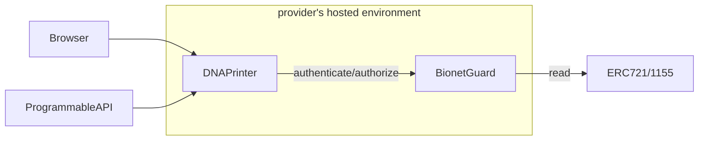
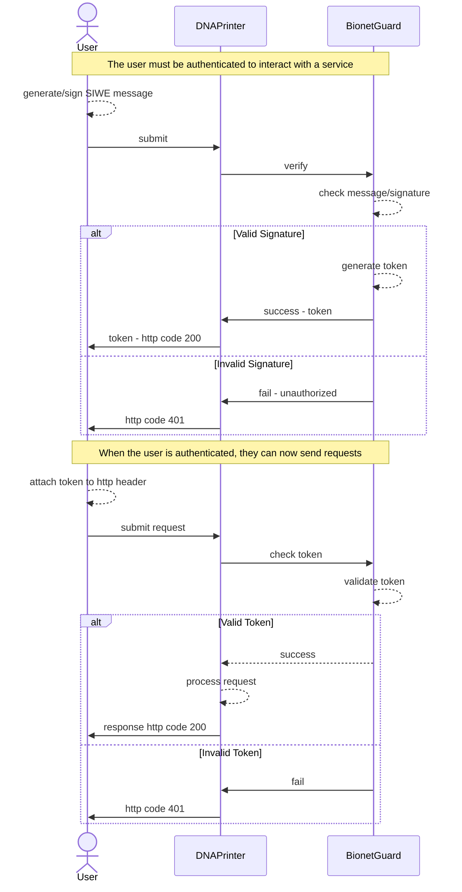
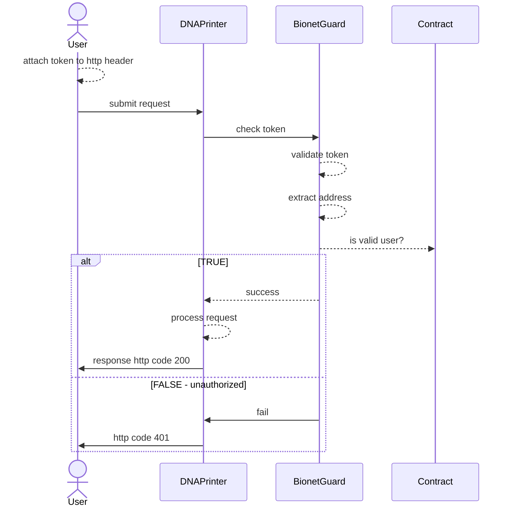

# Bionet Guard SDK

An authentication and authorization service for the Bionet using Sign in with Ethereum (SIWE)

## Overview 
The bionet will need a flexible, standardized approach for an access control capability to independent bionet resources/services. How can it be done in a way that doesn't rely on traditional Web2 access control services?

### Desired features:
* Authentication to bionet alliance resources and services
* Authorization to use an external service/lab (say in an API workflow)
* Flexible API service providers can use with their infrastructure
* User's don't need to create multiple accounts to interact with different services
* Reputation. Know your Biologist, Know you Alliance members, etc...

## Approach
* Provide a flexible, decentralized, self-custody system that doesn't require bionet operators to store and maintain passwords.
* Create a standardized, easy to use SDK bionet participants can use to integrate in to their architecture
* Provide a decentralized reputation system where users have full access and control of their reputation. 
* Build on emerging Web3 standards

## High-level Architecture

**DNAPrinter** is an example of a service offered by a Bionet provider

**BionetGuard** is a lightweight server, only accessible from localhost, that encapsulates all the logic needed by a service to check authentication/authorization

**Contracts** on-chain contracts deployed by providers to track consumer's.  For example, issuing an NFT to a consumer serves as a receipt that can be used to verify authorized users.

## Authentication

A user authenticates by sending a signed message using the SIWE protocol.  On Success, the user is provided a session token to use on subsequent requests.

## Sessions

Since we need to support stateless clients such as programmable scripts, JWT like tokens will be used.  Using a token prevents the need for the user to have to authenticate on each request. Tokens should support a limited life span (expiration date), and may contain other meta data

## Authorization
Authentication verifies the requestor is the owner of a given Ethereum address.  Authorization is needed to assert the user is allowed to interact with the service.  Providers can issue NFT like tokens to consumer and subsequently *burn* the tokens when a consumer is no longer authorized to use the service

## Requirements
- Python > 3.11
- Poetry
- Forge (and Rust) to build contracts

## Installation
1. Install Python
2. Install Poetry
3. From *this directory* run `poetry install` 

## Example

See example folder for simple service provider implementation and client.

